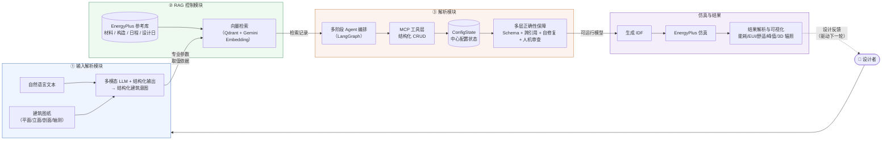

# EnergyPlus\-Agent\_论文主文档

# **EnergyPlus\-Agent：面向人机协同设计的 LLM 建筑能耗建模与仿真智能体**

## **EnergyPlus\-Agent：面向人机协同设计的 LLM 建筑能耗建模与仿真智能体**

## 摘要

EnergyPlus 是建筑能耗建模（BEM）的核心仿真引擎，但其输入对象繁多、跨引用关系复杂，使建模高度依赖专家、难以支持设计早期的快速迭代。现有 LLM 辅助 BEM 研究多面向既有建筑审计、城市尺度分析或一次性模型生成，存在设计阶段多轮交互支持不足、材料与构造等专业参数易产生幻觉、输入对象正确性缺乏多层保障、以及仿真输出难以直接转化为设计反馈等缺口。针对上述问题，本文提出 EnergyPlus\-Agent——一个面向建筑设计阶段的检索增强型建筑能耗模拟智能体系统。系统不让大语言模型直接编写 IDF，而是把自然语言文本与可选建筑图纸解析为结构化建筑意图，再通过基于 LangGraph 的多阶段 agent 编排（从基础对象到围护结构再到负荷系统）配合基于 Model Context Protocol 的工具层对 EnergyPlus 对象进行结构化创建与修改；引入 RAG 控制模块，使 agent 在生成材料热工参数、构造层次、日程曲线与设计日条件等关键物理量前先检索 EnergyPlus 参考库，将参数来源从“模型生成”约束为“检索取值”；并通过结构化输出、Pydantic Schema、跨引用校验、agent 自修复、人机审查与仿真报错反馈构成多层正确性保障。仿真完成后，系统自动解析 EnergyPlus 输出生成能耗、EUI、热舒适、峰值负荷、3D 热区能耗与外表面太阳辐照等设计者可理解的指标。本文以深圳单层 5 热区办公楼与多层中庭办公楼为案例，验证系统的端到端流程，并通过 RAG 消融实验量化检索增强对参数正确性与模型可运行性的作用。结果表明，EnergyPlus\-Agent 能把设计意图、专业参数、模型校验、仿真执行与结果反馈连接为一个面向设计者的协同闭环，显著降低 EnergyPlus 的建模门槛并减少参数幻觉。

## Abstract

EnergyPlus is a cornerstone simulation engine for building energy modeling (BEM), yet its numerous input objects and intricate cross\-reference relationships make modeling highly expert\-dependent and ill\-suited to the rapid iteration of early\-stage design. Existing LLM\-assisted BEM research mostly targets existing\-building audits, urban\-scale analysis, or one\-shot model generation, leaving gaps in design\-stage multi\-turn interaction, susceptibility to hallucination in professional parameters (materials, constructions, schedules), lack of multi\-layer guarantees on input correctness, and difficulty translating simulation outputs into actionable design feedback. To address these gaps, this paper proposes **EnergyPlus\-Agent**, a retrieval\-augmented agent system for building energy simulation at the design stage. Rather than letting a large language model author IDF directly, the system parses natural\-language text and optional architectural drawings into structured building intent, then orchestrates object creation through a LangGraph multi\-stage agent workflow (from foundation objects to envelope to load systems) backed by a Model Context Protocol tool layer. A RAG control module forces agents to retrieve the EnergyPlus reference library before emitting key physical quantities—thermal properties, construction layers, schedule profiles, and design\-day conditions—constraining the source of parameters from “generation” to “retrieval.” Correctness is safeguarded by structured output, Pydantic schemas, cross\-reference validation, agent self\-repair, human\-in\-the\-loop review, and EnergyPlus error feedback. After simulation, the system parses EnergyPlus outputs into designer\-interpretable metrics—energy use, EUI, thermal comfort, peak load, 3D zone energy, and exterior solar irradiance. Two Shenzhen cases (a single\-zone five\-zone office and a multi\-zone atrium office) validate the end\-to\-end pipeline, and a RAG ablation quantifies retrieval augmentation's effect on parameter correctness and model runnability. Results show that EnergyPlus\-Agent links design intent, professional parameters, model validation, simulation, and result feedback into a collaborative loop for designers, substantially lowering the EnergyPlus modeling barrier and reducing parameter hallucination.

## 关键词

建筑能耗建模；EnergyPlus；大语言模型；多智能体系统；检索增强生成；Model Context Protocol；早期设计；人机协同

## Keywords

Building energy modeling; EnergyPlus; Large language model; Multi\-agent system; Retrieval\-augmented generation; Model Context Protocol; Early\-stage design; Human\-AI collaboration

## 论文结构总览

1. Introduction：说明建筑能耗建模的重要性、EnergyPlus 使用门槛、LLM agent 的机会与不足，并提出本文系统。

2. Literature Review：梳理 LLM \+ BEM、EnergyPlus 自动建模、多智能体、MCP、RAG、BIM/早期设计优化等相关工作。

3. Methodology：先在引出文字中给出总体架构框架图，再分 3.1 输入解析模块（文本/图像处理、模型控制、用 RAG 衔接参数幻觉约束）、3.2 RAG 控制模块、3.3 解析模块（多阶段 agent 编排 + MCP 工具层 + 多层正确性保障）、3.4 案例设置。

4. Results：4.1 RAG 消融实验 → 4.2 引入 RAG 后的工作流运行结果（端到端流程、RAG 交互、错误修复）→ 4.3 结果解析出什么、怎么分析 → 4.4 与传统流程对比。

5. Discussion：不复述结果，分析 RAG 压制幻觉、跨引用校验、结果解析驱动反馈闭环等现象的成因，并讨论当前局限与未来工作。

6. Conclusion：总结降低建模门槛、提升效率和减少参数幻觉的贡献。

7. References：整理引用文献和项目来源。

# 1\. Introduction

建筑行业是全球能源消耗和碳排放的重要来源。根据 GlobalABC/UNEP 发布的建筑与建造全球状态报告，建筑相关活动约占全球能源需求的 32%，并产生约 34% 的能源相关二氧化碳排放。因此，在建筑设计阶段引入可靠的能耗评估方法，对于降低运行能耗、优化围护结构与系统方案、支持低碳设计决策具有重要意义。建筑能耗建模（Building Energy Modeling, BEM）正是在这一背景下形成的关键技术路径。以 EnergyPlus 为代表的物理仿真引擎能够对建筑热过程、围护结构传热、人员与设备负荷、HVAC 系统以及气象条件进行较精细的模拟，是建筑性能分析和节能优化中的重要工具。

然而，EnergyPlus 的强大能力也伴随着较高的使用门槛。一个可运行的 EnergyPlus 模型通常需要同时定义建筑几何、热区、材料、构造层、窗户、运行时间表、人员与照明负荷、HVAC 系统、输出变量和气象文件等内容。这些对象之间存在大量跨引用关系，例如表面必须引用已有热区和构造，构造必须引用已有材料，HVAC 系统必须引用已有热区、恒温器和时间表。任何字段格式、对象命名或引用关系的错误，都可能导致模型无法通过校验或仿真失败。对于建筑师和早期设计者而言，这一过程不仅耗时，而且需要持续依赖能耗建模专家，限制了 BEM 在方案早期快速迭代中的使用。

近年来，大语言模型（Large Language Models, LLMs）的发展为降低 EnergyPlus 的使用门槛带来了新的可能。研究者已从多个角度展开探索：从自然语言直接生成 EnergyPlus 模型、用 agentic workflow 与工具调用协调建模过程、封装 EnergyPlus 的 Model Context Protocol（MCP）基础设施、用多智能体系统完成复杂性能分析，以及把 LLM 引入早期设计与体量生成（相关工作详见第 2 章）。这些工作表明，LLM 在建筑能耗建模中的角色正在从”文本生成器”转向”工具协调者”，并已在一定程度上降低了建模与分析的操作门槛。

尽管如此，现有研究仍存在若干不足（详见第 2\.4 节）：多数工作面向既有建筑审计、改造分析、城市尺度分析或自动报告生成，较少支持设计阶段的多轮交互式建模；LLM 在生成材料热工参数、构造层次和运行时间表时易产生幻觉；EnergyPlus 输入的强约束结构难以仅靠 LLM 直接生成保证正确；仿真输出复杂，缺少自动化解析与可视化反馈。这些缺口共同指向一个需求——把”设计意图解析、专业参数检索、模型校验、仿真执行和结果反馈”连接为一个面向设计者的闭环。

针对上述问题，本文提出 **EnergyPlus\-Agent**，一个面向建筑设计阶段的检索增强型建筑能耗模拟智能体系统。该系统并不让 LLM 直接编写完整 IDF 文件，而是将自然语言建筑描述解析为结构化任务，再通过多阶段 agent 工作流逐步创建 EnergyPlus 配置对象。系统基于 LangGraph 构建了从 `intake` 到 `zone`、`material`、`schedule`、`construction`、`surface`、`fenestration`、`hvac`、`people`、`lights`、`validate`、`simulate` 和 `analyze` 的节点流程；通过 MCP 工具层对 Building、Zone、Material、Construction、Schedule、HVAC、People、Lights 等对象进行结构化创建和修改；通过 RAG 检索材料、构造、日程和设计日等 EnergyPlus 参考数据；并通过 Pydantic Schema、跨引用验证、agent 自修复、人机审查和 EnergyPlus 运行反馈共同保障模型输入的正确性。

在系统实现上，EnergyPlus\-Agent 维护一个中心化的 `ConfigState` 作为建筑配置状态。各个 agent 节点并行或顺序生成对应子系统对象，并将结果合并到共享状态中。系统在关键阶段执行跨引用检查：若发现构造引用不存在的材料、表面引用不存在的热区或构造、窗户引用不存在的表面、HVAC 引用不存在的日程等问题，会将错误反馈给对应 agent 进行自修复；若模型通过验证，则进入人工审查和 EnergyPlus 仿真阶段。仿真完成后，系统解析 `eplusout.end`、`eplusout.err`、`eplusout.csv` 和 `eplustbl.csv/html` 等输出文件，生成能耗、热舒适、峰值负荷、运行时间表、3D 热区能耗和外表面太阳辐照等结果图表，并将分析结果返回给设计者和 LLM，用于支持下一轮设计判断。

本文的主要贡献如下：

1. 提出一个面向设计阶段的 EnergyPlus 智能体框架，将自然语言交互、多节点任务分解、MCP 工具调用、模型验证、仿真执行和结果解析连接为闭环。

2. 构建检索增强的 BEM 参数生成机制，使 agent 能够主动查询材料、构造、日程和设计日等专业参考数据，减少 LLM 对关键物理参数的主观猜测。

3. 设计多层正确性保障机制，通过结构化输出、Schema 验证、跨引用检查、agent 自修复、人机审查和仿真错误反馈，提高 EnergyPlus 输入模型的一致性和可运行性。

4. 实现面向设计反馈的仿真结果解析与可视化，将复杂 EnergyPlus 输出转化为设计者可理解的能耗、舒适性和空间性能指标。

5. 通过案例研究展示 EnergyPlus\-Agent 如何降低 EnergyPlus 建模门槛、减少人工操作，并支持建筑设计阶段更高效的能耗方案探索。

# 2\. Literature Review

## 2\.1 自动化建筑能耗建模

传统 BEM 自动化研究主要关注从规则、模板、BIM、GIS、审计数据或传感器数据中自动生成建筑能耗模型。早期工作以 EPlus\-LLM 为代表，将大型语言模型用于从建筑描述直接生成 EnergyPlus 模型，并调用仿真引擎 API 自动运行，证明了 LLM 能够显著减少人工建模工作量。面向几何无关 IDF 生成的 AI 自动化方法则利用 LLM、提示模板与 EnergyPlus 模型库，从自由文本中生成可仿真的建筑能耗模型，强调对建模者专业门槛的降低。近期 Data2BEM 通过 LLM 多智能体框架，从图纸、技术规格书和传感器数据中生成并校准既有建筑能耗模型，将传统人工建模时间压缩近一个数量级。知识工程驱动的多智能体 BEM 服务进一步说明，将规范、流程和领域知识结构化后，可以提升城市尺度既有建筑的自动建模能力。

这些工作证明了自动化 BEM 的可行性，但其重点主要面向既有建筑、城市尺度建模或改造分析；本文更关注设计阶段与设计者共同迭代的交互式建模。

## 2\.2 LLM 与多智能体建筑性能分析

随着 agentic workflow 和工具调用能力的发展，研究重点从"让 LLM 直接生成模型"转向"让 LLM 调用工具完成建模过程"。一类工作通过 agentic workflow 自动开发并调试建筑能耗模型，把传统 BEM 中反复修改、检查和运行的过程转化为可由 LLM agent 协调的工作流；另一类工作提出平台无关的 LLM agent schema 与工具库，用于提升建筑能耗分析与建模任务的自动化程度。多智能体系统则被用于更复杂的性能分析任务：AutoBEE 利用分层多智能体系统完成从自然语言指令到建筑能耗与环境性能报告的自动分析；BEM-AI 通过 Agent\-to\-Agent 通信构建动态多智能体建模流程。与此同时，面向 EnergyPlus 的 MCP 基础设施开始出现：EnergyPlus\-MCP 将建模、仿真和结果处理能力封装为 Model Context Protocol server，使 LLM 能通过标准化协议调用 EnergyPlus 工具；MCP\-enabled agentic AI workflow 进一步在会话式集成与多 agent 工作流两种范式下验证了 MCP 的工具互操作能力。近期也有研究将检索增强生成（RAG）与 MCP 结合，用于城市尺度建筑能耗仿真和韧性评估，说明检索增强与工具协议正成为 LLM\-BEM 系统的重要发展方向。

这些研究已经从"LLM 直接生成文本"走向"LLM 调用工具完成任务"，但仍需更系统地解决 EnergyPlus 输入对象正确性、跨引用错误修复、RAG 专业参数检索和设计反馈闭环。

## 2\.3 LLM 辅助设计生成与 BIM 建模

LLM 正在进一步进入建筑设计生成阶段。Text2BIM 通过多智能体框架把自然语言指令转化为可编辑的 BIM 模型，并辅以规则检查器迭代修复；EnergAI 将 LLM 引入早期建筑体量生成，把能耗优化目标嵌入生成式设计；Sketch\-to\-Energy 结合多模态 LLM、计算机视觉与 RAG，从草图与自然语言要求生成 EnergyPlus 模型。

需要强调的是，BIM 或体量生成并不等同于可运行、可验证、可解析的 EnergyPlus 仿真闭环。本文的差异在于把设计意图、专业参数、模型校验、仿真执行和结果反馈连接起来。

## 2\.4 研究缺口

现有研究已经证明 LLM 可以生成模型、多智能体可以执行分析、MCP 可以封装工具、RAG 可以增强专业知识，但面向设计阶段的 BEM 仍存在以下缺口：

1. 交互式多轮方案探索支持不足。

2. 材料、构造和时间表等专业参数容易出现 LLM 幻觉。

3. EnergyPlus 对象字段、命名和跨引用关系缺少多层正确性保障。

4. 仿真输出难以直接转化为设计者可理解的反馈。

5. 从自然语言输入到仿真结果分析的完整闭环仍不充分。

# 3\. Methodology

本文构建了一个面向设计阶段的检索增强型 EnergyPlus 智能体系统 EnergyPlus\-Agent。系统整体由四个模块组成（见总体架构图）：**① 输入解析模块**负责把设计者的自然语言文本与可选建筑图像解析为结构化的建筑意图；**② RAG 控制模块**在专业参数生成前检索材料、构造、日程和设计日等 EnergyPlus 参考数据，用以约束 LLM 的参数幻觉；**③ 解析模块**（多阶段 agent 编排 + MCP 工具层 + 配置状态 + 多层校验）把结构化意图逐阶段转化为可运行、可校验的 EnergyPlus 配置对象，并执行仿真；**④ 案例设置**定义用于评估系统的建筑案例与对照实验。下面分别说明这四个模块。

> **图 1　EnergyPlus\-Agent 总体架构。** 设计者的自然语言文本与可选建筑图纸进入输入解析模块，得到结构化建筑意图；RAG 控制模块在专业参数生成前检索材料/构造/日程/设计日等参考数据以约束参数幻觉；解析模块（多阶段 agent 编排 + MCP 工具层 + 中心配置状态 + 多层校验）把意图逐阶段转化为可运行的 EnergyPlus 模型并执行仿真；结果解析与可视化反馈回到设计者，驱动下一轮交互。



> 【说明】①②③ 与正文 3\.1–3\.3 一一对应；解析模块（③）把"要什么"（来自①）与"用什么值"（来自②）合并为可运行的 EnergyPlus 配置，并通过仿真与结果解析把反馈送回设计者，形成人机协同闭环。

## 3\.1 输入解析模块

输入解析模块接收两类输入：**文本输入**（建筑的自然语言描述）和**图像输入**（可选的建筑图纸，如平面图、立面图、剖面图、轴测图或透视图）。

**文本处理**：设计者的自然语言描述被封装为系统提示加用户消息送入大语言模型。系统提示明确规定输出必须为单一原始 JSON 对象，且建筑、场地、热区、材料、日程、构造、表面、窗、HVAC、人员、照明等子系统字段均为必填；同时给出跨子系统命名一致性约束（构造/日程/热区名称在各 `*_specs` 之间必须逐字匹配）和 IDF 安全命名规范（仅允许字母、数字与下划线，禁用空格、逗号、分号、连字符等 IDF 字段分隔符）。模型以**结构化输出（structured output / function calling）**形式返回符合 `IntakeOutput` schema 的对象，从而把自由文本约束为可被下游阶段消费的结构化意图。

**图像处理**：当用户提供建筑图纸时，模块将图像读取并以 base64 编码的多模态内容块（image content part）与文本内容块一同送入多模态大语言模型，由模型从图纸中提取房间功能、几何与布局信息，再与文本描述合并为统一的结构化意图。这样系统在设计早期既可接受纯文字描述，也可接受图纸输入。

**模型与控制**：模块通过统一的 LLM 工厂创建模型实例，并对模型施加结构化输出约束，使解析结果在进入下一阶段前即被限定在合法 schema 之内。当上一轮出现校验错误时，错误信息会作为反馈拼入本轮输入，引导模型修正。

**用 RAG 控制幻觉**：输入解析阶段得到的只是结构化"意图"（材料类型、构造层次、日程模式等），而材料的热工参数、构造的具体材料引用、日程的取值曲线等**专业物理参数**并不由语言模型的内部知识直接给出，而是交由后续 RAG 控制模块从 EnergyPlus 参考数据库检索后填入。换言之，输入解析模块负责"要什么"，RAG 控制模块负责"用什么值"，二者衔接形成对参数幻觉的第一层约束（详见 3.2）。

## 3\.2 RAG 控制模块

RAG 控制模块的目标是：在 agent 生成材料热工参数、构造层次、日程取值曲线和设计日条件等关键物理参数之前，**先从专业数据库检索真实参考数据**，再以检索结果作为参数依据，从而避免 LLM 凭语言模型内部知识或经验默认值"猜"出不真实或不合 EnergyPlus 规范的参数。

**控制的内容**：模块覆盖标准材料（含导热系数、密度、比热等热工参数）、无质量材料、构造做法（层次顺序与材料引用）、ScheduleTypeLimits、Schedule:Compact（工作日/周末的时间段取值曲线）和设计日（干球温度、湿球温度等）等 EnergyPlus 参考数据。agent 在生成材料、构造或日程对象时，先发起一次检索，再用返回记录中的完整数据作为创建对象的依据。

**怎么控制的**：模块以一个 `search_energyplus_reference` 检索工具的形式挂载到 agent 的工具集中。每次检索带有允许检索的表、返回条数（top\-k）和相似度阈值等控制参数；agent 仅得到与查询相关的若干条记录，并在其基础上构造结构化对象，而非自由发挥参数数值。检索后端由向量数据库承载、由 Gemini 文本嵌入模型生成向量，并内置速率限制、并发控制和对限流的自动重试，以支持大规模参考库的稳定检索。

**优雅降级**：当向量数据库或嵌入模型因配置缺失或服务不可用而无法工作时，模块不会中断流程，而是返回明确的降级提示，指导 agent 改用 ASHRAE 默认值继续建模，保证整体流程的鲁棒性。

## 3\.3 解析模块

解析模块负责把输入解析得到的结构化意图逐阶段转化为**可运行、可校验**的 EnergyPlus 配置对象。它由三个要素共同构成：

**（1）多阶段 agent 编排**：系统基于 LangGraph 将建模任务拆分为多个专业节点，按依赖关系组织为如下拓扑——基础对象与负荷子系统可并行生成，关键阶段之间插入跨引用检查，校验通过后再进入仿真与分析：

`intake -> [zone, material, schedule] -> cross_ref_foundations -> construction -> surface -> fenestration -> [hvac, people, lights] -> cross_ref_complete -> validate -> simulate -> analyze`

> **图 2　多阶段 Agent 编排流程。** 节点之间的依赖关系由 LangGraph 编排：`intake`/`revise` 同时扇出到基础对象（zone/material/schedule）并并行生成；基础对象汇入 `cross_ref_foundations` 做首次跨引用确认（不通过则短路到 `validate` 反馈修复）；随后构造→表面→窗户顺序生成；围护完成后 HVAC/人员/照明并行生成并汇入 `cross_ref_complete`；`validate` 经人机审查后批准进入 `simulate→analyze`，或带反馈回到 `intake`/`revise`。

```mermaid
flowchart TD
    START((START)) --> entry{"首轮？<br/>/ 修订轮"}
    entry -- 首轮 --> intake["intake<br/>解析结构化意图"]
    entry -- 修订轮 --> revise["revise<br/>修订意图"]

    intake --> Z["zone<br/>热区"]
    intake --> M["material<br/>材料 ⊕RAG"]
    intake --> S["schedule<br/>日程 ⊕RAG"]
    revise --> Z
    revise --> M
    revise --> S

    Z --> crf["cross_ref_foundations<br/>基础跨引用校验"]
    M --> crf
    S --> crf

    crf -- "引用完整" --> C["construction<br/>构造 ⊕RAG"]
    crf -. "引用断裂<br/>短路反馈" .-> VAL

    C --> SF["surface<br/>表面"]
    SF --> F["fenestration<br/>窗户"]

    F --> H["hvac<br/>HVAC ⊕RAG"]
    F --> P["people<br/>人员"]
    F --> L["lights<br/>照明"]
    H --> crc["cross_ref_complete<br/>完整跨引用校验"]
    P --> crc
    L --> crc

    crc --> VAL["validate<br/>人机审查 + 多层校验"]
    VAL -- "批准" --> SIM["simulate<br/>生成 IDF + 运行 EnergyPlus"]
    VAL -. "拒绝/带反馈" .-> revise
    SIM --> ANZ["analyze<br/>结果解析与可视化"]
    ANZ --> END((END))

    classDef rag fill:#eef9f0,stroke:#3b8b5a;
    class M S C H rag;
    classDef gate fill:#fdf3ee,stroke:#c87a3b;
    class crf crc VAL gate;
```

其中材料、日程与热区等基础对象先生成并完成一次跨引用确认，构造、表面、窗户再依次生成，HVAC、人员、照明等负荷子系统在围护结构完成后生成，最后进行一次完整的跨引用校验。带 "⊕RAG" 标记的节点表示该阶段在生成对象前会先检索 EnergyPlus 参考库（见 3\.2）。

**（2）MCP 工具层与中心配置状态**：系统不让 LLM 直接拼接 IDF 文本，而是通过基于 Model Context Protocol 的工具层对 Building、Location、Zone、Surface、Material、Construction、Fenestration、Schedule、HVAC、People、Lights 及工作流操作执行结构化的创建/查询/修改/删除。所有对象由一个中心化的配置状态统一保存，并支持导出与加载配置、校验引用、生成摘要和运行仿真。

**（3）多层正确性保障**：解析模块通过层层约束保证输入正确性——结构化输出与 Pydantic Schema 约束字段类型、枚举、几何与基础参数；跨引用校验检查材料、构造、表面、窗户、热区、HVAC 与日程之间的引用关系；每个阶段 agent 执行后强制校验，发现错误即将错误反馈给该 agent 自修复；完整校验通过后进入人机协同审查；EnergyPlus 运行后读取 `.err` 与 `.end` 文件，将 severe/fatal 错误反馈给系统。

## 3\.4 案例设置

为评估系统，设置两类建筑案例，均位于深圳：**① 简单办公室案例**——单层 5 热区办公楼，包含基本围护、窗户、人员、照明与 ideal loads HVAC；**② 复杂中庭办公楼案例**——5 层办公楼，含中央中庭、天窗、多功能空间、服务器机房，并采用差异化的日程与 HVAC 设置。基于上述案例设计对照实验：以"是否引入 RAG"为变量对比参数与仿真结果差异，并以端到端流程展示从自然语言输入到仿真结果反馈的完整闭环（详见第 4 章）。

# 4\. Results

## 4\.1 RAG 消融实验

为量化 RAG 控制模块对参数正确性与仿真可运行性的作用，以"是否引入 RAG"为单一变量在上述案例上做对照：关闭 RAG 时 agent 仅依赖语言模型内部知识与 ASHRAE 默认值生成参数；开启 RAG 时 agent 在生成材料、构造、日程与设计日对象前先检索参考库。对照指标如下表，数据待补。

|指标|Without RAG|With RAG|
|---|---|---|
|材料参数错误/缺失数量|待测|待测|
|构造层引用错误数量|待测|待测|
|日程对象缺失数量|待测|待测|
|IDF 验证通过率|待测|待测|
|EnergyPlus 成功运行率|待测|待测|
|人工修正次数|待测|待测|

## 4\.2 引入 RAG 后的工作流运行结果

在开启 RAG 的条件下，展示系统从零开始的完整端到端运行（整体 pipeline 见运行截图）。

> 【pipeline 运行截图占位】

端到端流程依次为：① 用户输入建筑描述与可选图纸/气象文件；② intake 解析为结构化意图；③ zone/material/schedule 节点生成基础对象，过程中对材料、构造或日程发起 RAG 检索；④ cross\-reference 确认基础引用关系；⑤ construction/surface/fenestration 节点生成围护结构；⑥ hvac/people/lights 节点生成系统与内部负荷；⑦ cross\-reference 完成完整引用校验；⑧ validate 节点进行人工审查；⑨ simulate 节点生成 IDF 并运行 EnergyPlus；⑩ analyze 节点输出报告与图表。

**RAG 交互示例**。下表展示材料、构造、日程与设计日四类典型检索：agent 发起查询后，以返回记录的完整数据作为创建对象的依据。

|阶段|查询意图|RAG 返回|Agent 使用方式|
|---|---|---|---|
|Material|查询混凝土、岩棉、石膏板参数|导热系数、密度、比热等|创建 Material 对象|
|Construction|查询外墙构造|层次顺序和材料引用|创建 Construction 对象|
|Schedule|查询办公日程|工作日/周末时间段|创建 Schedule:Compact|
|HVAC|查询设计日参数|干球温度、湿球温度等|用于 sizing 或默认设置|

**错误修复与回退案例**。运行中可能出现以下错误：构造引用了不存在的材料、表面引用了不存在的热区或构造、窗户引用了不存在的表面、恒温器引用了不存在的日程，以及 EnergyPlus 运行产生的 severe/fatal 错误。本节展示系统如何发现错误、反馈给对应 agent 完成修复，并最终进入仿真。

## 4\.3 结果解析：解析了什么、怎么分析

仿真完成后，分析节点解析 EnergyPlus 输出文件（`eplusout.end`、`eplusout.err`、`eplusout.csv`、`eplustbl.csv/html`，必要时 `eplusout.eso`），生成设计者可直接理解的图表，主要包括：① 仿真状态、警告与严重错误；② 年度终端用途能耗与 EUI；③ 分区月度 HVAC 能耗；④ 分区温度热力图；⑤ 热舒适小时数；⑥ HVAC 峰值需求曲线；⑦ 温湿度散点与 PMV 舒适区；⑧ 3D 热区能耗图；⑨ 3D 外表面太阳辐照图；⑩ 人员与设备运行时间表热力图。

> 【结果图表占位：上述分析图集合】

对每一组图表，不仅给出数值，更要模拟建筑师看到图表之后的判断——例如由温度热力图与舒适小时数定位过热/过冷时段，由 EUI 与分项能耗定位主要耗能项，由峰值需求曲线与 3D 太阳辐照图识别围护与朝向的薄弱面，从而把仿真结果转化为下一轮设计决策。

## 4\.4 与传统流程对比

|对比项|传统 EnergyPlus 流程|EnergyPlus\-Agent 流程|
|---|---|---|
|输入方式|手动填写 IDF 或 OpenStudio 建模|自然语言/图片/天气文件|
|参数来源|人工查规范、材料库、经验值|RAG 检索 \+ 默认值|
|对象创建|手动创建各类 IDF 对象|多节点 agent 调用工具创建|
|错误处理|人工阅读 err 文件修复|Schema \+ cross\-reference \+ self\-repair|
|结果解析|人工查看 CSV/HTML|自动统计、图表和报告|
|设计迭代|修改成本高|对话式修改并重新仿真|

# 5\. Discussion

## 5\.1 为什么 RAG 能有效压制参数幻觉

从消融对比看，开启 RAG 后材料热工参数与构造层引用的错误明显减少。其成因不在于 RAG "更聪明"，而在于它改变了参数的**来源**：当语言模型必须自行给出导热系数、密度、比热等数值时，这些量在训练语料中出现频率低、单位混杂，模型倾向于给出形似但失真的"经验值"或编造数值；而 RAG 把生成问题退化为"从检索到的真实记录中取值"，数值本身不再由模型产出，幻觉在数值层面被切断。此外，检索结果是 EnergyPlus 规范内的标准对象，构造层顺序、Schedule 取值曲线也由此与 EnergyPlus 输入约定对齐，减少了"格式对、语义错"的隐性错误。

## 5\.2 为什么跨引用校验比单点 Schema 校验更关键

即便每个对象单独通过 Pydantic 校验，EnergyPlus 模型仍可能因引用断裂而无法运行。这是因为 EnergyPlus 的对象之间是**强约束的图结构**（表面→热区/构造、窗户→表面、HVAC→日程/热区），错误往往不在单个字段内，而在对象之间的边。把校验从"逐字段"提升到"跨引用"，使系统能定位到具体的缺失对象而非笼统的"建模失败"；而把错误回灌给对应阶段 agent 自修复，则把"一次性生成"改造成了"局部可收敛"的迭代——这也是系统能在复杂中庭案例中逐步收敛到可运行模型的根本原因。

## 5\.3 为什么结果解析决定了反馈闭环是否真正成立

仿真能跑通并不等于设计者能用上结果。EnergyPlus 原始输出（CSV/HTML/ESO）信息密集、专业门槛高，若仅原样返回，设计者仍需专家协助解读，闭环就在"最后一公里"断裂。系统将结果解析为 EUI、舒适小时、峰值负荷、3D 热区能耗与外表面太阳辐照等与设计决策直接挂钩的指标，本质上是把"工程仿真量"翻译成"设计语言"；正是这一步，才让能耗反馈能够真正驱动下一轮方案修改，而非停留在报告层面。一个值得注意的现象是：当反馈被压缩成少数结构化指标时，设计者（及 LLM 自身）的决策质量反而提升——这说明反馈的"可读性"与"分辨率"同样关键。

## 5\.4 当前局限

1. 复杂几何、复杂 HVAC 系统和详细控制策略仍可能需要专家介入。

2. LLM 生成的空间划分和表面几何仍需要人工检查。

3. RAG 数据库质量、覆盖范围和地区适用性会影响结果可靠性。

4. 当前验证主要关注字段和跨引用，尚不能完全保证工程合理性。

5. EnergyPlus 结果依赖输入假设，agent 不能替代专业校准。

## 5\.5 未来工作

1. 接入 BIM、CAD、平面图和剖面图，实现更稳定的多模态几何理解。

2. 扩展 HVAC 系统类型和控制策略。

3. 加入规范合规检查。

4. 建立系统 benchmark，比较不同 LLM、agent 拓扑和 RAG 配置。

5. 加入版本管理，记录每轮方案修改和仿真结果。

6. 将结果摘要压缩为更适合 LLM 决策的结构化指标。

# 6\. Conclusion

本文提出 EnergyPlus\-Agent，一个面向建筑设计阶段的检索增强型建筑能耗模拟智能体系统。系统通过 LLM 解析设计意图，通过 LangGraph 将任务分解为多个专业节点，通过 MCP 工具创建结构化 EnergyPlus 配置对象，通过 RAG 检索现实材料、构造和日程参数，并通过多层验证、自修复和仿真结果解析形成闭环。

案例研究将进一步验证该系统能否降低 EnergyPlus 建模门槛，提高建模和仿真流程的一致性，减少 LLM 参数幻觉，并帮助设计者更快理解能耗、热舒适、峰值负荷和太阳辐照等关键结果。未来，系统可进一步扩展到多模态图纸输入、复杂 HVAC、自动优化和规范合规检查，为人机协同的建筑性能设计提供更完整的工具链。

# 7\. References

[1] GlobalABC / UNEP. *Global Status Report for Buildings and Construction 2024/2025*. UN Environment Programme, 2025. https://www.unep.org/resources/report/global-status-report-buildings-and-construction-20242025

[2] U.S. Department of Energy / NREL. *EnergyPlus Documentation*. National Renewable Energy Laboratory. https://energyplus.net/documentation

[3] Jiang, G., Ma, Z., Zhang, L., Chen, J., et al. EPlus\-LLM: A large language model\-based computing platform for automated building energy modeling. *Applied Energy*, 2024, 367: 123431. https://doi.org/10.1016/j.apenergy.2024.123431

[4] ElSayed, M., Shultz, N. User\-friendly AI\-driven automation for rapid building energy model generation. *Energy and Buildings*, 2025, 345: 116092. https://doi.org/10.1016/j.enbuild.2025.116092

[5] Zhang, L., Ford, V., Chen, Z., Chen, J. Automatic building energy model development and debugging using large language models agentic workflow. *Energy and Buildings*, 2025, 327: 115116. https://doi.org/10.1016/j.enbuild.2024.115116

[6] Zhang, L., Fu, X., Li, Y., Chen, J. Large language model\-based agent Schema and library for automated building energy analysis and modeling. *Automation in Construction*, 2025, 176: 106244. https://doi.org/10.1016/j.autcon.2025.106244

[7] Lu, Z., Zheng, et al. Automated building energy modeling for energy retrofits using a large language model\-based multi\-agent framework (Data2BEM). *iScience*, 2025, 28(11): 113867. https://doi.org/10.1016/j.isci.2025.113867

[8] Quan, Y., Xiao, T., Gu, J., Xu, P. AutoBEE: A hierarchical multi\-agent approach for energy and environmental parameter analysis. *Energy and Buildings*, 2025, 349: 116516. https://doi.org/10.1016/j.enbuild.2025.116516

[9] Li, X., et al. Development of a dynamic multi\-agent network for building energy modeling (BEM\-AI). *Energy and Buildings*, 2025: 116712. https://doi.org/10.1016/j.enbuild.2025.116712

[10] Li, H., Xu, Y., Hong, T. EnergyPlus\-MCP: A model\-context\-protocol server for AI\-driven building energy modeling. *SoftwareX*, 2025. https://www.sciencedirect.com/science/article/pii/S2352711025003334 （代码：https://github.com/LBNL-ETA/energyplus-mcp）

[11] Li, H., Zhang, L., Zhou, H., Hong, T. MCP\-enabled agentic AI workflow for building energy modelling: framework and use cases. *Journal of Building Performance Simulation*, 2026. https://doi.org/10.1080/19401493.2026.2653969

[12] Zhou, J., Chen, J., et al. Large language model orchestrated workflow integrating retrieval\-augmented generation and model context protocol tools for urban\-scale simulation\-based resilience assessment. *Building and Environment*, 2026. https://www.sciencedirect.com/science/article/pii/S0360132326003598

[13] Zhang, Y., Wang, G., Xu, P. Sketch\-to\-Energy model automation with multimodal LLMs and retrieval\-augmented generation. *Energy and Buildings*, 2026: 117387. https://www.sciencedirect.com/science/article/abs/pii/S0378778826004470

[14] Du, C., Esser, S., Nousais, S., Borrmann, A. Text2BIM: Generating building models using a large language model\-based multiagent framework. *Journal of Computing in Civil Engineering* (ASCE). https://doi.org/10.1061/JCCEE5.CPENG-6386 （预印本 arXiv:2408.08054）

[15] Zhong, J., Li, P., Luo, R., et al. EnergAI: A large language model\-driven generative design method for early\-stage building energy optimization. *Energies*, 2025, 18(22): 5921. https://doi.org/10.3390/en18225921

[16] Anthropic. *Model Context Protocol* (MCP), 2024. https://modelcontextprotocol.io

> 备注：参考文献已补齐作者、年份、期刊、卷期与 DOI。其中 ref [6] 此前误记为 "LLM\-Agent\-UMI"，经核实该文献实为 Zhang 等（2025）的 agent Schema and library 一文，并无 UMI / 城市建模视角，已据实订正；ref [9] BEM\-AI 的贡献是动态多智能体网络（Agent\-to\-Agent），其 MCP 能力应归因于 ref [10][11] 的 LBNL 系列 MCP 工作，正文中已据此区分。部分 2026 年在线发表文章的最终卷期/页码以出版社正式见刊为准。

## 文档变更记录

本文档已按 2026\-06\-16 的重组意图调整结构：

- **Methodology**：整体精简至 3.4；总体架构作为方法论引出文字 + 框架图（占位），不再单开一章，也不写具体实现细节；正文为 3.1 输入解析模块（文本/图像处理、模型控制、用 RAG 衔接）→ 3.2 RAG 控制模块 → 3.3 解析模块 → 3.4 案例设置（案例归入方法论）。
- **Results**：调整为 4.1 RAG 消融实验（原 4.7 提前）→ 4.2 引入 RAG 后的工作流运行结果（含端到端流程、RAG 交互示例、错误修复，并保留 pipeline 运行截图）→ 4.3 结果解析（解析了什么、怎么分析、模拟建筑师对图表的判断）→ 4.4 与传统流程对比（原 4.6）。
- **Discussion**：不复述结果，改为对现象成因的分析（RAG 为何压制幻觉、跨引用校验为何更关键、结果解析为何决定反馈闭环）+ 局限 + 未来工作。
- **本范围暂不纳入**：node 无法自愈时的回退节点、前端、自优化、用视频描述 agent 工作过程——这些为已完成项或后续选题，不在本次重组内展开。

